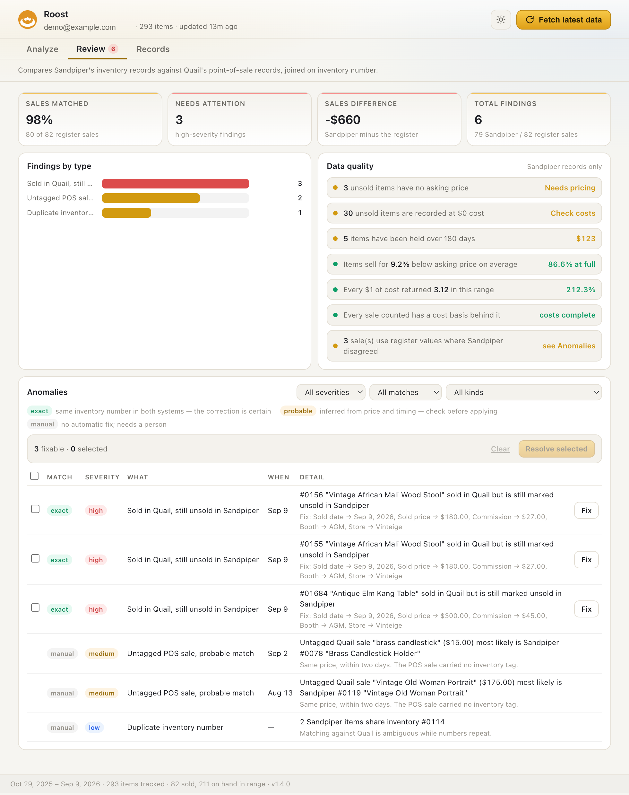

<p align="center">
  
</p>

<h1 align="center">Roost</h1>

<p align="center">
  <b>Know what your booth actually made.</b><br>
  Analytics and reconciliation for Sandpiper inventory and Quail point-of-sale,<br>
  in a Chrome extension that runs entirely in your own browser.
</p>

<p align="center">
  <a href="#install">Install</a> ·
  <a href="#screenshots">Screenshots</a> ·
  <a href="#features">Features</a> ·
  <a href="#if-something-goes-wrong">Help</a>
</p>

---

Roost gives [Sandpiper](https://app.sandpiperhq.com) the analytics it doesn't have, and
reconciles those records against the [Quail](https://vendor.quailhq.com) point-of-sale system
behind the stores your stock actually sells through.

Sandpiper tracks what you own and what it cost. Quail knows what was charged, what commission
came off, and when the customer really bought. Neither is a complete account on its own. Roost
pulls both using your existing logged-in sessions, reconciles them into a single ledger, and
renders a dashboard in the toolbar popup. Everything stays in your own browser — no server, no
third-party scripts, nothing phones home.

---

## Screenshots

### Analyze — the money ladder, register rhythm and where the stock sits


### Sync — what the two systems disagree about



---

## Features

### Three modes

Views are grouped by the kind of question they answer, not by which system the data came from.
Each mode has its own tabs and its own range presets.

| Mode | Tabs | Kind of question |
| --- | --- | --- |
| **Analyze** | Overview · Sales · Inventory · Catalog · Venues | "how is the business doing" — Overview carries the money ladder and the register's daily view |
| **Sync** | *(single page)* | a task list — "what needs fixing", and where the two systems are brought into line |
| **Records** | Items · POS sales | lookup — "find this specific thing", each page answering for one system |

**Each mode owns its date range.** Changing the window in one mode leaves the others alone, and
switching back restores what that mode was showing, custom ranges included. On a fresh open
Analyze starts at All time and Records at 90D. Your last mode, and the last tab within each
mode, are remembered.

**Sync has no date picker.** It always covers everything: reconciliation exists to prove the
two systems agree, and a window can only hide a disagreement that is still live. The anomaly
badge counts over that same full range, so it never disagrees with the tab it points at.

The **⤢** button opens the same dashboard full-width in a tab.

### Analytics

Every number respects the selected date range, using the rule that matches the metric:

| Metric group | Basis |
| --- | --- |
| Sales, revenue, profit, margin | items **sold** inside the range |
| Buying, spend, acquisitions | items **acquired** inside the range |
| Inventory, aging, potential profit | a point-in-time **snapshot** as of the range end |

- **Net payout** = gross sales − commission − card fees
- **Take-home** = net payout − booth rent, prorated to the window — the money the store
  actually hands over
- **Net profit** = take-home − cost of goods (`totalCost`, which includes restoration)
- **Gross profit** = net payout − cost of goods — profit before rent, which is why Overview
  leads with take-home instead and gross profit sits on the Sales tab
- **Potential profit** = asking price of unsold stock, less your observed commission rate,
  minus what that stock cost you
- **Commission rate** is derived from your own sales history rather than hard-coded
- Plus ROI, sell-through, inventory turns, days of supply, average and median days to sell,
  average discount off asking price, markup multiple, aging buckets, price bands, and
  per-category performance (categories are inferred from item descriptions)

Headline figures carry a **▲ / ▼ against the previous period of the same length**, shown only
where that period actually had activity to compare against. Compact labels like `$4.8k` can hide
up to $200, so every money KPI carries its exact value in a tooltip.

### Register rhythm, from Quail

Sandpiper's `sold` timestamp is when the sale was keyed in — typically hours later and in
batches (76% of sampled sales land within two minutes of another). Quail's timestamps are the
real register times, which is what makes the daily view on Overview meaningful: daily takings
including dead days, day of week averaged per occurrence, hour of day, and basket size. The
daily, weekday and hour charts each carry a **$ / Units** toggle, and either way the tooltip
reports both figures. Payment method stays a column and a filter on the POS sales table, where
it is something you search by rather than a chart that reads the same every time.

**Booth rent** is a fixed monthly cost Sandpiper has no field for, so every Sandpiper profit
figure is overstated by it. It is also the cost that arrives whether or not anything sells,
which is why Overview charts net payout against rent over twelve months — the keep-or-drop
question needs a direction, and a single "rent covered" percentage cannot show one. Roost reports takings after commission *and* rent, prorated to the
elapsed part of the window — charging a full month against a three-day-old month would make a
healthy booth look like a failing one.

### Reconciliation

The Sync page joins the two systems on inventory number and reports what disagrees:

| Finding | Meaning |
| --- | --- |
| Sold in Quail, unknown to Sandpiper | POS sale with an inventory number Sandpiper has never seen |
| Sold in Quail, still unsold in Sandpiper | Inventory and potential profit are overstated |
| Sold in Sandpiper, no Quail record | Sold elsewhere, or outside the fetched Quail window |
| Untagged POS sale, probable match | Rang up without a tag; matched to a Sandpiper sale on price and time |
| POS sale with no inventory tag | Rang up without a tag and with no plausible counterpart |
| Sale price disagrees | The two systems recorded different numbers |
| Commission disagrees | The two systems recorded different numbers |
| Recorded late | Entered more than three days after it sold |
| Duplicate inventory number | Sandpiper reuses numbers, making any join ambiguous |

An untagged POS sale and an unrecorded Sandpiper sale at the same price within two days are
reported as **one** probable pairing rather than two separate anomalies. Data-quality checks on
the Sandpiper records themselves sit on the same page, since both are things to act on.

Those checks are the way into the work rather than a report about it: a finding that stands for
a set of items — stock with no asking price, stock recorded at $0 cost, anything held over 180
days, sales the register saw that Sandpiper never recorded — is a button, and pressing it opens
Records filtered to exactly those items, where they can be corrected. The window travels with
the click, so the rows listed are the same rows the number counted. Findings that describe a
rate rather than a set, like the average discount off asking, stay as text.

### Resolving anomalies

Where a finding can be settled by correcting Sandpiper, the fix is offered inline. Quail is
treated as the register of record: it knows what was actually charged and when, so Sandpiper is
corrected to match it, never the reverse.

| Finding | Fix written |
| --- | --- |
| Sold in Quail, still unsold in Sandpiper | sold date, price, commission, card fees, booth and store |
| Sale price disagrees | sold price |
| Commission disagrees | commission |
| Recorded late | sold date corrected to the register time |
| Untagged POS sale, probable match | aligns date, price and commission — **selection only** |

Every row carries a **Match** chip saying how far the systems can be trusted to agree:

- **exact** — matched on inventory number in both systems, so the correction is certain
- **probable** — inferred from a matching price and time; worth checking before applying
- **manual** — no automatic fix, this one needs a person

Two ways to apply: **Fix** on a single row, or tick rows and **Resolve selected**. The table
filters by severity, match and kind, and the checkbox in the header selects every fixable row
currently in view — so narrowing to *exact* and selecting all is the deliberate way to clear a
batch. Bulk actions only ever touch visible rows, and a selection is dropped when a filter hides
it, so nothing off-screen can be edited. Selecting a probable match is allowed, but the
confirmation says how many of the batch rest on one.

A single row's **Fix** applies straight away: one deliberate click on one item, with the exact
change already printed beneath the finding. Bulk actions confirm first, listing every field with
its before and after value, because you cannot see all of their changes at once. Edits are
applied one at a time so a partial failure stops somewhere understandable, and the local cache
updates in place as each succeeds, so resolved findings disappear immediately without a full
re-sync.

The Sync tab carries a badge with the number of anomalies in range, turning red when any are
high severity, so it is visible from any mode.

### Stores and booths

Sandpiper stamps a store and booth onto an item **only when it sells** (`inBooth` is unused), so
the venue dimension covers sales and cannot describe unsold stock. The dashboard is explicit
about this rather than quietly mixing the two:

- The venue selector beside the date range scopes **sales-derived** figures. Buying and
  inventory stay account-wide, and the footer says so whenever a scope is active.
- The Venues tab always lists every venue, even while a scope is applied, so you can compare.
- Sales with no venue recorded are grouped as *No store/booth recorded* rather than dropped.
- The selector hides itself entirely when there's only one store and one booth.

Booth rows show the commission rate you were **actually** charged next to the `consignmentRate`
on the booth record, and flag the difference in red when they diverge. Names come from the API;
clicking one lets you rename it, and your name always wins (kept in `chrome.storage.local`).

### Appearance

The sun/moon button in the top bar switches between light and dark. On first run it follows your
OS setting; after that your choice is remembered (`localStorage`, shared by the popup and the
full-tab view). Both themes are driven entirely by CSS custom properties, including the chart
colours: `refreshPalette()` in `lib/charts.js` re-reads the `--chart-*` variables on every
render, so SVG grid lines, axes, crosshairs and series colours all follow the theme without
duplicated colour logic.

---

## Install

Roost isn't in the Chrome Web Store, so you install it by downloading a folder and pointing
Chrome at it. It sounds technical, but it's really five short steps and takes about five
minutes. **You don't need to know how to code, and you'll never open a terminal.**

You'll need Google Chrome on a computer — this doesn't work on a phone or tablet.

### Step 1 · Download Roost

1. Go to **[github.com/alexmattson/roost](https://github.com/alexmattson/roost)**
2. Click the green **Code** button near the top right
3. Choose **Download ZIP** from the menu that drops down
4. The file lands in your **Downloads** folder as `roost-main.zip`

### Step 2 · Unzip it, and put it somewhere safe

Double-click `roost-main.zip`. You'll get a folder called **`roost-main`** sitting next to it.

**Now move that folder somewhere permanent** — your Documents folder is a good choice. This
matters more than it sounds: Chrome doesn't copy Roost anywhere, it just remembers where the
folder lives and reads it every time you start your browser. If the folder gets deleted, moved,
or emptied out of your Downloads, **Roost stops working**. Pick a home for it now and leave it
there.

### Step 3 · Tell Chrome about it

1. Open Chrome, click in the address bar, and type **`chrome://extensions`** then press Enter

   *You have to type it — it's a Chrome settings page, so it can't be linked to.*

2. Find the **Developer mode** switch in the **top-right corner** and turn it **on**

   *This is normal. It's the standard way to install an extension that isn't in the Chrome
   Web Store, and it doesn't make your browser any less safe on its own.*

3. Three new buttons appear at the top left. Click **Load unpacked**

4. A file picker opens. Navigate to your **`roost-main`** folder, **select the folder itself**
   (single-click it — don't open it and don't pick a file inside), and click **Select**

5. Roost appears in your list of extensions with its nest logo and a version number. That's it —
   it's installed

If Chrome shows a small warning about developer-mode extensions when you start it up, that's
expected and you can dismiss it.

### Step 4 · Pin Roost to your toolbar

Right now Roost is installed but hidden away.

1. Click the **puzzle-piece icon** to the right of Chrome's address bar
2. Find **Roost** in the list
3. Click the **pin icon** next to it

The orange nest logo now sits in your toolbar, and you click it any time you want your numbers.

### Step 5 · Sign in, then get your data

Roost reads the data you already have access to, using the fact that you're logged in. It never
asks for a password and never sees one.

1. In a normal Chrome tab, sign in to **[app.sandpiperhq.com](https://app.sandpiperhq.com)** —
   this is required, it's where your inventory comes from
2. In another tab, sign in to **[vendor.quailhq.com](https://vendor.quailhq.com)** — technically
   optional, but without it you lose real sale times, booth rent, payment methods, and the entire
   Sync page. Sign in to both
3. Click the **Roost icon** in your toolbar
4. Click **Fetch latest data**

The first load takes a few seconds while it pulls everything down. After that your dashboard
opens instantly, and the numbers only change when you click that button again — so click it
whenever you want fresh figures.

**You're done.** Nothing you just did sends your data anywhere: it's read from the two sites you
already use and stored in your own browser.

### Keeping Roost up to date

There's no automatic update, since Roost isn't coming from the Chrome Web Store. When there's a
new version:

1. Download and unzip the new ZIP, exactly as in steps 1 and 2
2. **Replace** your old `roost-main` folder with the new one, keeping it in the same place
3. Go to **`chrome://extensions`** and click the **circular reload arrow (↻)** on Roost's card

That last step is easy to forget and Roost will behave oddly without it — so if a new version
seems not to have changed anything, that reload arrow is almost always why. Roost also watches
for this itself and shows a red banner when it notices.

### If something goes wrong

| What you're seeing | What it means |
| --- | --- |
| **There's no "Load unpacked" button** | Developer mode is still off. It's the switch in the top-right corner of `chrome://extensions`. |
| **"Manifest file is missing or unreadable"** | The wrong folder got picked. You want the folder that has `manifest.json` sitting directly inside it — usually `roost-main`. If you opened a folder and it only contained one other folder, go one level deeper and try that. |
| **Roost disappeared after restarting Chrome** | The folder was moved, renamed, deleted, or cleaned out of Downloads. Put it back, or download it again, then repeat Step 3. |
| **A message about your session or being signed out** | Your login to Sandpiper or Quail expired. Open the site, sign in again, then click **Fetch latest data**. |
| **A red banner about the build** | Click the reload arrow (↻) on Roost's card at `chrome://extensions`. |
| **Everything is empty** | You haven't clicked **Fetch latest data** yet, or you're signed out of Sandpiper. |

### For developers

Clone it instead, and the update path becomes `git pull` plus the same reload arrow:

```bash
git clone https://github.com/alexmattson/roost.git
cd roost
```

Load that folder unpacked as above. There's no build step and no dependencies — the repository
*is* the extension.

## Roost on the web

The same dashboard runs as a website, with no extension to install. A start screen signs you in
to both systems and keeps the tokens in the tab; everything else — every chart, every edit,
every reconciliation — is the identical code.

The two sign-ins differ, because the two companies do. **Quail** takes an email and password
right on the screen. **Sandpiper** does not allow that from another site, so instead you drag a
one-time bookmark to your bar and click it while signed in to Sandpiper: it reads your session
and returns you to Roost signed in. (A manual token paste is there as a fallback.)

**Nothing moves to a server, because there is no server.** The APIs send permissive CORS, so the
page talks to each service directly from your browser, exactly as the extension does — and the
bookmarklet returns the token through the URL fragment, which browsers never send anywhere.
GitHub Pages only ever serves static files.

### Hosting it on GitHub Pages

1. Push this repository to GitHub (it already lives at
   [github.com/alexmattson/roost](https://github.com/alexmattson/roost)).
2. **Settings → Pages**. Under **Build and deployment**, set **Source** to *Deploy from a branch*,
   pick the **main** branch and the **/ (root)** folder, and **Save**.
3. Wait a minute, then open `https://<you>.github.io/roost/`. That's the app.

There is no build step — the repository is the site. The extension's own files
(`manifest.json`, `background.js`) sit alongside and are simply unused on the web.

### The trade-offs, honestly

- **A Quail password is typed into a page that is not Quail.** Roost only ever exchanges it for
  a token and never stores or forwards it, but a `github.io` address asking for a vendor password
  has the shape of a phishing page. (Sandpiper avoids this — the bookmarklet means its password
  is only ever entered on Sandpiper itself.) A custom domain helps; asking both vendors for real
  API access helps more.
- **Tokens live in `sessionStorage`** — they survive a reload but not closing the tab, and never
  leave the browser. Signing out clears them and the cached data.
- **The open CORS both APIs send is arguably a bug on their side.** If either tightens it, the
  website stops working (the extension, which is same-origin by permission, would not).

For those reasons the extension remains the recommended way to run Roost. The website exists for
people who cannot or will not install an unpacked extension.

## How it works

- **Auth** — in the extension, the service worker reads your `sandpiper_s` session cookie via
  `chrome.cookies`, decodes the JWT to find your account id, and sends the request with both the
  cookie and an `Authorization: Bearer` header. Quail authenticates separately, with
  `Authorization: Basic base64(<vendor email>:<session id>)`, both halves read from its cookies.
  On the web there is no cookie to read. Quail signs in on the page — its `api/auth/login`
  sends CORS and returns the session id in the body. Sandpiper cannot: its `login` route sends
  no CORS headers, so a browser on another origin can't exchange a password for a token, only
  use one it already holds. Its `sandpiper_s` cookie is script-readable, though, so a
  bookmarklet run on the Sandpiper tab reads the token and hands it back through the URL
  fragment; from there the `Bearer` header is identical to the extension's. Either way, nothing
  is stored anywhere but your own browser.
- **Requests** — `POST /api/items/v2/<account>/items?from=0&to=10000000` with
  `{"filters":[],"orderBy":"ACQUIRED","reverse":true}`. The range is deliberately huge so a
  single call returns everything. Then `GET /api/stores/<accountId>` and
  `GET /api/booths/<accountId>` to resolve venue names — note these are **account-scoped list
  endpoints**: they return every store/booth on the account, and passing a store or booth id
  instead returns `403 Forbidden`. Venue failures are reported but never sink an item sync. Each
  Quail refresh pulls booth terms, line-item sales, and one rent call per calendar month; a
  missing Quail session is reported but never blocks an inventory sync.
- **Fallback** — if the direct call is refused, the same request is re-run inside an open
  Sandpiper tab so it goes out same-origin.
- **Storage** — results land in `chrome.storage.local` and the dashboard renders from that cache
  on every open.
- **Charts** — hand-rolled SVG (`lib/charts.js`). Extension CSP blocks remote scripts, so there
  are no third-party libraries.
- **Writes** — `POST /api/items/v2/<accountId>/edit` replaces the whole item rather than patching
  it, so each payload starts from the untouched API row with only the planned fields overlaid —
  that is why the raw rows are cached alongside the normalised ones. A successful edit answers
  **204 No Content**, so responses are read as text and an empty body is treated as success;
  parsing it as JSON unconditionally would report a successful write as a failure *and* trigger
  the in-page fallback to write a second time.

### One set of numbers

`lib/ledger.js` overlays register truth onto the inventory records, pairs untagged register
sales with their Sandpiper counterpart, and adds any sale the register saw that Sandpiper has
not recorded. Every **business figure** reads that one ledger, so two views cannot disagree
about the same window.

Records is the deliberate exception. Its two pages are lookup, not analysis, and each answers
for a single system: **Items** is what Sandpiper holds, **POS sales** is what the register
rang. Merging them there would mean editing a row while looking at another system's version of
it — which is also why Items is the one place edits can be trusted to show up exactly as typed.
Sync is where the two are held against each other.

### Units

All money from the Sandpiper API is in **cents** and is treated as such throughout. Quail mixes
units inside one object: `listPrice`, `salePrice` and `discountAmount` are dollars, while
`taxAmount`, `consignmentAmount` and `cardFeeAmount` are cents. `lib/quail.js` converts
everything to cents at the boundary.

### Layout

| Path | Role |
| --- | --- |
| `manifest.json` | MV3 manifest — permissions, host permissions, service worker, popup |
| `index.html` / `popup.js` / `popup.css` | The dashboard — the extension popup, the full tab, and the website, all the same page |
| `main.js` | Entry point for both builds; starts the controller once the platform is chosen |
| `lib/platform.js` | Picks the world at load: chrome storage + background worker, or web storage + inline backend |
| `background.js` | Extension only — the service worker: cookie auth, fetching, caching, writes |
| `lib/core.js` | The API orchestration both builds share, with nothing of where it runs |
| `lib/webbackend.js` | Web only — login, an inline stand-in for the worker, localStorage caching |
| `theme.js` | Applies the saved theme before first paint (a classic, non-deferred script — MV3's CSP forbids inline scripts, so it can't live in the HTML) |
| `lib/analytics.js` | Metric computation over the ledger |
| `lib/ledger.js` | Reconciles Sandpiper and Quail into one set of numbers |
| `lib/quail.js` | Quail client, unit normalisation, register-rhythm analytics |
| `lib/reconcile.js` | Finds what the two systems disagree about |
| `lib/resolve.js` | Turns a finding into a Sandpiper edit |
| `lib/charts.js` | Hand-rolled SVG charts, theme-aware |
| `tools/make-icons.py` | Regenerates the icon set |

---

## Reference

### Vocabulary

One term per idea, used identically in every card, chart, series and table header. The money
figures form a ladder — one deduction per rung, in the order the money actually leaves — and
each card names the deduction it just made:

| Term | Meaning |
| --- | --- |
| **Gross sales** | what the register rang up |
| **Commission** | the store's cut |
| **Net payout** | gross sales less commission and card fees |
| **Booth rent** | rent for the window, prorated |
| **Take-home** | net payout less rent — what the store actually pays you |
| **Cost of goods** | what the stock that sold had cost you |
| **Net profit** | take-home less cost of goods — the number that is actually left |
| **Gross profit** | net payout less cost of goods — profit before rent |
| **Stock at cost** | unsold inventory at what you paid |
| **Asking value** | that same stock at its asking prices |
| **Potential profit** | asking value less commission, less what it cost |

### What the colour bar means

The stripe on a KPI card says one thing only: how that number is doing.

| | |
| --- | --- |
| green | healthy, nothing to do |
| amber | worth an eye |
| red | needs attention |
| none | a descriptive figure with no better or worse direction |

A card whose value has nothing behind it (potential profit with no stock) carries no colour
rather than a flattering green.

---

## Developer notes

These are for people working on Roost itself — if you're just using it, the
[help table above](#if-something-goes-wrong) is the one you want.

**Changes to `background.js` don't seem to apply.** MV3 caches the service worker. The popup
files are re-fetched every time you open it, but the worker keeps running whatever was loaded
when the extension was installed. Click the reload (↻) icon on the extension's card at
`chrome://extensions`.

**Watching the requests.** Service worker fetches never appear in the Sandpiper page's Network
tab — only in the worker's own inspector (`chrome://extensions` → Roost → *Inspect views:
service worker*). Note the console only captures logs emitted while it's open, so open it before
hitting fetch. Each sync logs a `[Roost]` line with the venue counts it resolved, and the popup
banner reports the same thing without any DevTools.

**More than one account.** If your login covers several, the first is used. To switch, open the
service worker console from `chrome://extensions` and run:

```js
chrome.runtime.sendMessage({ type: 'setAccount', accountId: '<uuid>' })
```
